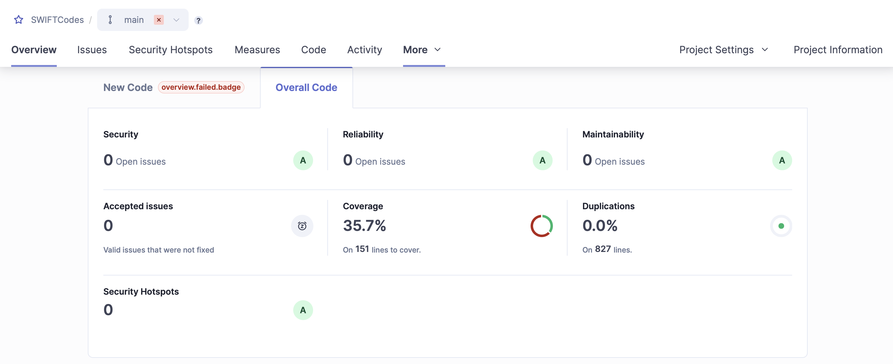

# SWIFT Codes Project

This project provides functionality for managing and importing SWIFT codes and country information. It allows users to interact with SWIFT code data, including adding, deleting, and importing data from Excel files.

## Technologies Used

- **Java 17**
- **Spring Boot** (for creating the application and exposing REST APIs)
- **Postgres** (for storing data)
- **JUnit** (for testing)

## Prerequisites

- Java 17 or higher
- Maven (for dependency management and build)
- Git (for version control)
- A database (I used Postgres)

## Getting Started

### 1. Clone the repository

To get started with the project, clone the repository to your local machine:

```bash
git clone https://github.com/Mrozu888/Intern_Exercise_Swift.git
```

### 2. Setup database information

In order to configure the database connection for your local environment, you need to modify the `src/main/resources/application.properties` file.

#### What to modify:
Change the following properties to match your local database settings:

```properties
# PostgreSQL Database Configuration
spring.datasource.url=jdbc:postgresql://localhost:5432/<database>
spring.datasource.username=<db_login>
spring.datasource.password=<db_password>
```

### Running the Application

To start the application, you have two options:

#### Option 1: Using IntelliJ IDEA
1. **Open the Project**: Open the project in IntelliJ IDEA.
2. **Run the Application**: Simply run the application using the built-in run configuration for Spring Boot (usually a green play button in the top right corner).

#### Option 2: Using Maven Command Line
1. **Clean and Build the Project**: Open a terminal in the root directory of the project and run the following command to clean and build the project:

   ```bash
   mvn clean install
   ```

2. **Run the Application**: After the build is successful, you can start the application by running:
    ```bash
   java -jar target/SWIFTCodes-0.0.1-SNAPSHOT.jar
   ```


### Importing Data via Excel File

To import SWIFT code data from an Excel file, you can use the **POST** endpoint `/v1/swift-codes/import`. This endpoint allows you to upload an Excel file, which will be processed and the data will be saved to the database.

### Endpoint:
`POST /v1/swift-codes/import`

### How to Use:

To import an Excel file containing SWIFT code data, follow these steps:

1. **Prepare the Excel File**: Excel file is in root directory of the project `Interns_2025_SWIFT_CODES.xlsx`.

2. **Make a POST Request**:
    - Use a tool like Postman to send a `POST` request.
    - Set the `file` parameter in the request body(form-data) to the Excel file you want to upload.

### Request Example:

#### Using Postman:
- Set the HTTP method to **POST**.
- Enter the URL: `localhost:8080/v1/swift-codes/import`.
- Under **Body**, choose **form-data**.
- Add a new key-value pair:
    - **Key**: `file`
    - **Value**: Choose the file to upload from your local machine.


# SWIFT Code API

This API allows you to manage SWIFT codes, including retrieving, adding, deleting, and uploading SWIFT code data. Below is a detailed description of each available endpoint.

---

## **Endpoints**

### Endpoint 1: Get SWIFT Code Details by SWIFT Code
**GET**: `/v1/swift-codes/{swiftCode}`

Fetch details of a specific SWIFT code, including associated bank and country information.

Response Structure:
```json
{
  "address": string,
  "bankName": string,
  "countryISO2": string,
  "countryName": string,
  "isHeadquarter": bool,
  "swiftCode": string,
  "branches": [
    {
          "address": string,
          "bankName": string,
          "countryISO2": string,
          "isHeadquarter": bool,
          "swiftCode": string
    }, . . .
    ]
}
```


Response Structure for branch swift code:
```json
{
    "address": string,
    "bankName": string,
    "countryISO2": string,
    "countryName": string,
    "isHeadquarter": bool,
    "swiftCode": string
}
```

Response if not found:
```json
{
    "message": string
}
```

### Endpoint 2: Get All SWIFT Codes for a Country

***GET***: `/v1/swift-codes/country/{countryISO2code}`

Fetch all SWIFT codes for a given country based on its ISO2 code.

Response Structure:
```json
{
    "countryISO2": string,
    "countryName": string,
    "swiftCodes": [
        {
            "address": string,
    		 "bankName": string,
    		 "countryISO2": string,
    		 "isHeadquarter": bool,
    		 "swiftCode": string
        },
        {
            "address": string,
    		 "bankName": string,
    		 "countryISO2": string,
    		 "isHeadquarter": bool,
    		 "swiftCode": string
        }, . . .
    ]
}
```
Response if not found:
```json
{
    "message": string
}
```


### Endpoint 3: Adds new SWIFT code entries to the database for a specific country.
***POST***:  `/v1/swift-codes`

Add a new SWIFT code to the database.

Request Structure :
```json
{
    "address": string,
    "bankName": string,
    "countryISO2": string,
    "countryName": string,
    "isHeadquarter": bool,
    "swiftCode": string,
}
```
Response Structure:

```json
{
  "message": string,
}
```

### Endpoint 4: Deletes swift-code data if swiftCode matches the one in the database.
***DELETE***:  `/v1/swift-codes/{swift-code}`

Delete a SWIFT code from the database.

Response Structure:
```json
{
    "message": string,
}
```

### Endpoint 5: Import data from excel.
***POST***:  `/v1/swift-codes/import`

Import data from excel file.

Response Structure:
`Body->Data-form->(choose_file)`


# Code Quality Analysis with SonarQube

This project integrates with [SonarQube](https://www.sonarqube.org/), a popular open-source platform for continuous inspection of code quality. SonarQube helps track various aspects of code quality, such as:

- **Code coverage**: Ensures the percentage of code tested by unit tests is visible.
- **Code duplication**: Detects repeated code across the project.
- **Code smells**: Identifies maintainability issues and non-optimal code patterns.
- **Bug detection**: Finds potential bugs or logical errors within the code.
- **Security vulnerabilities**: Highlights security risks and potential exploits in the application.




# Documentation

Docs for this project are stored in `target/site/apidocs/index.html`.